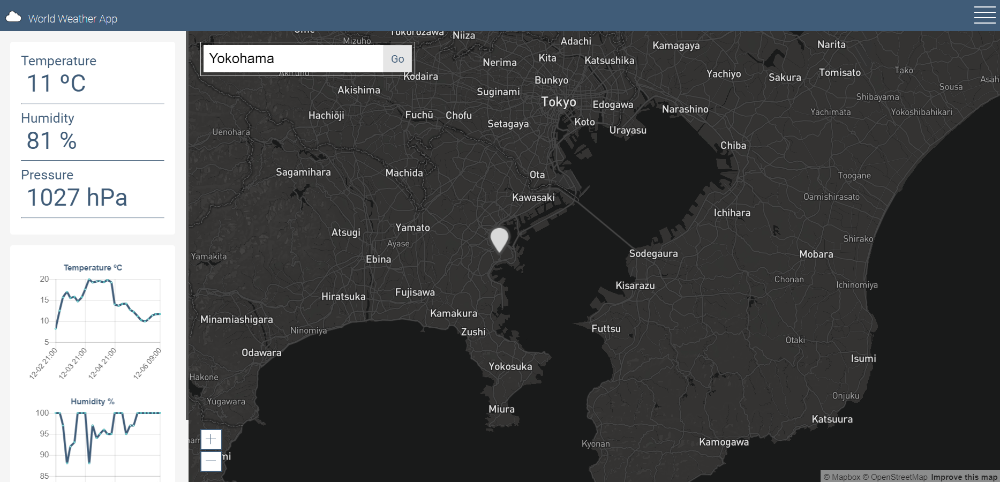

# Redux-Weather-App

## [Demo](https://adrisolid.github.io/Redux-Weather-App/)

Fetching world weather data from [Weather API](https://openweathermap.org/api) using React/Redux and the [React wrapper for mapbox-gl-js](https://github.com/alex3165/react-mapbox-gl)



## To run

* You'll need to have [git](https://git-scm.com/) and [node](https://nodejs.org/en/) installed in your system.
* Fork and clone the project:

```
git clone https://github.com/AdriSolid/Redux-Weather-App.git
```

* Then install the dependencies:

```
npm install
```

* Run development server:

```
npm start
```

